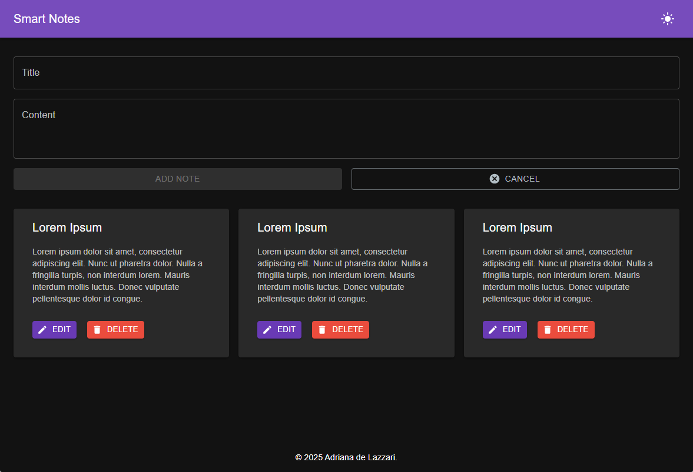
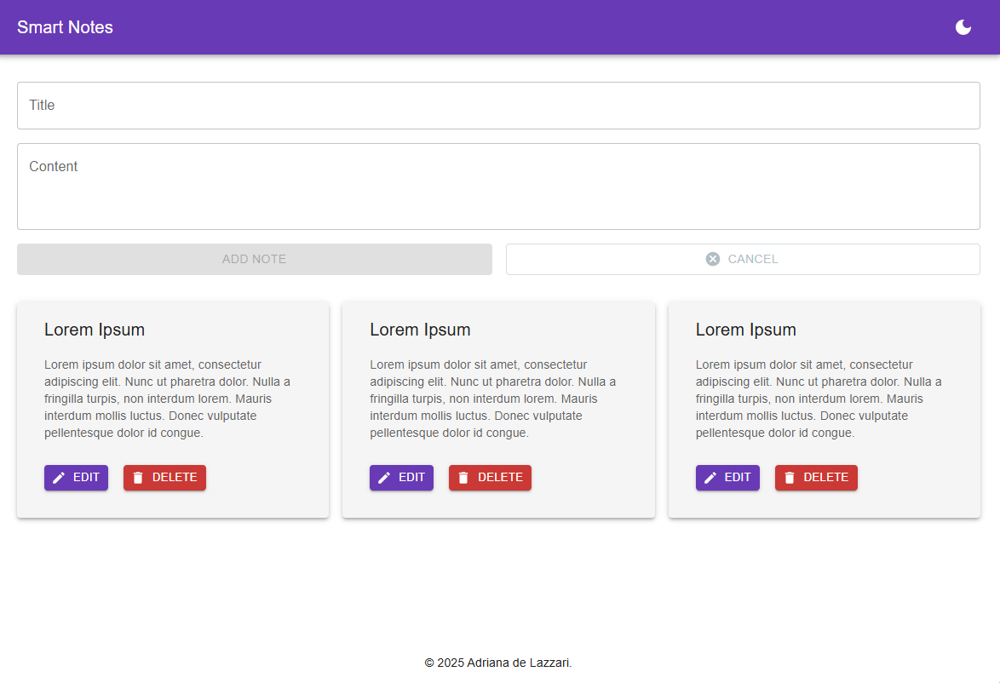
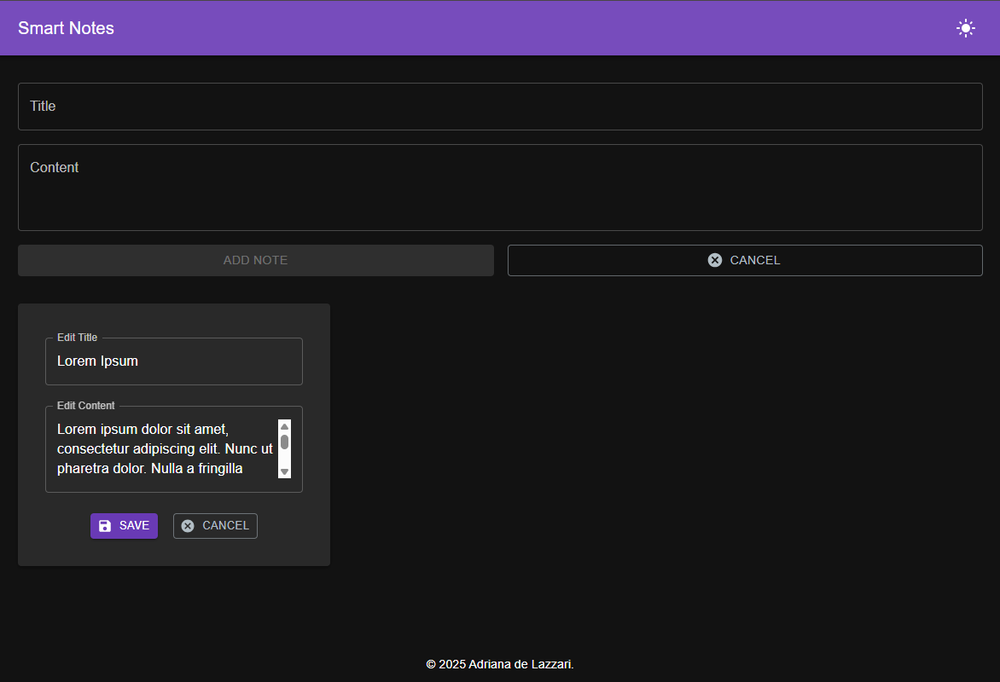

# 📝 Smart Notes

A modern and user-friendly **note-taking application** built with **React** and **Material UI**.  
Easily create, edit, and delete notes with a clean and minimalistic interface.

## 🚀 Features

✅ Create, edit, and delete notes  
✅ Auto-save notes in **local storage**  
✅ Responsive design with **Material UI**  
✅ Intuitive and user-friendly UI  
✅ Dark Mode support

## 📸 Screenshots







## 🛠️ Tech Stack

- ⚛ **React** – Frontend framework
- 🎨 **Material UI** – Styling & Components

## 🔧 Installation & Setup

Follow these steps to run **Smart Notes** locally:

### 1️⃣ Clone the Repository

```sh
git clone https://github.com/adrianadelazzari/smart-notes.git
cd smart-notes
```

### 2️⃣ Install Dependencies

```sh
npm install
```

### 3️⃣ Start the Development Server

```sh
npm start
```

Now, open http://localhost:3000/ in your browser.

### 📜 License

This project is open-source under the [MIT License](https://mit-license.org/).
